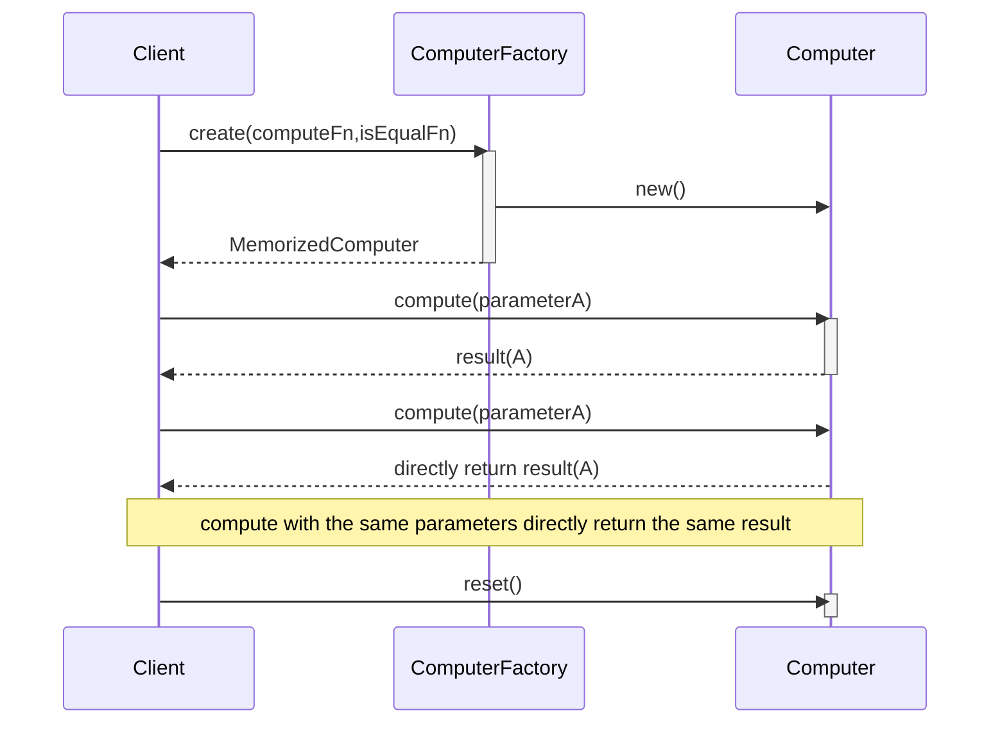

# MemorizedCompute Pattern
---
author: Jason Song <metaseed@gmail.com>
version: 1.1.0
tag: [pattern,memorize]
enable: [toc]
---

```ts
export function createMemoizedComputer(
  compute: AnyFn,
  isEqual = isEqualCheck
): MemoizedComputer {
  let lastArguments: null | IArguments;
  let lastResult: any;

  function reset() {
    lastArguments = undefined;
    lastResult = undefined;
  }

  function memoizedCompute(): any {
    if (!lastArguments) {
      lastResult = compute.apply(null, arguments);
      lastArguments = arguments;

      return lastResult;
    }

    for (let i = 0; i < arguments.length; i++) {
      if (!isEqual(arguments[i], lastArguments[i])) {
        lastResult = compute.apply(null, arguments);
        lastArguments = arguments;

        return lastResult;
      }
    }

    return lastResult;
  }

  return { memoizedCompute, reset };
}
```


