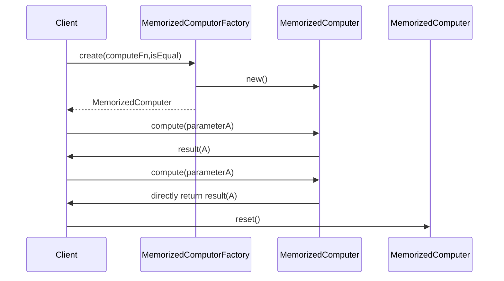

# MemorizedCompute Pattern

```ts
export function createMemoizedComputor(
  compute: AnyFn,
  isEqual = isEqualCheck
): MemoizedComputor {
  let lastArguments: null | IArguments = null;
  let lastResult: any = null;

  function reset() {
    lastArguments = null;
    lastResult = null;
  }

  function memoizedCompute(): any {
    if (!lastArguments) {
      lastResult = compute.apply(null, arguments);
      lastArguments = arguments;

      return lastResult;
    }

    for (let i = 0; i < arguments.length; i++) {
      if (!isEqual(arguments[i], lastArguments[i])) {
        lastResult = compute.apply(null, arguments);
        lastArguments = arguments;

        return lastResult;
      }
    }

    return lastResult;
  }

  return { memoizedCompute, reset };
}
```


